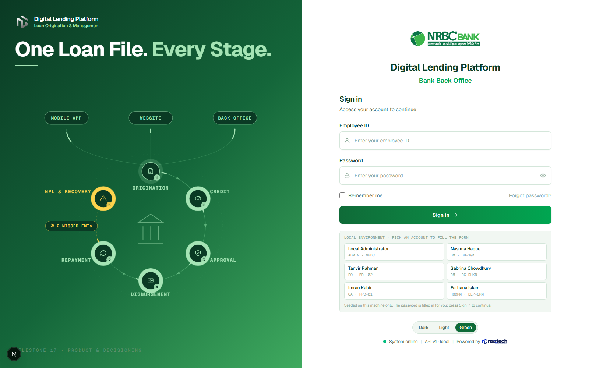

# Digital Lending Platform



A configurable, bank-grade digital lending and account opening platform for
**NRBC Bank**, built by **naztech**. The first lending product is **e-Loan**;
further products (Quick, Instant, Personal, Car, Student, Home, SME/CMSME,
Credit Card) are introduced through configuration and product versioning rather
than new codebases.

> ### Current state: Milestones 1–8 and 13–17 complete
>
> The platform can now answer the two questions that come before a loan
> application: **may this customer borrow**, and **on what terms**.
>
> In place: infrastructure and migrations; authentication with sign-in, MFA,
> session rotation and a login audit trail; role-based access control; the
> bank's organisational hierarchy and the scope rules that follow from it; the
> customer master; the **product catalogue and its versioning**; a generic
> **rule engine**; the **eligibility** and **loan amount** engines; and the
> **pricing calculator**.
>
> Not yet built: loan applications, workflow, credit analysis, approval,
> disbursement, repayment and collections. Onboarding (Milestones 9–12) is
> deferred by instruction.
>
> **173 unit tests, all passing.** Full detail in
> [milestone status](docs/milestone-status.md).

## What works today

| Capability | Endpoint | Screen |
| ---------- | -------- | ------ |
| Sign in, MFA, session rotation | `/api/v1/auth/*` | `/login` |
| The bank's unit hierarchy and your scope | `/api/v1/organization/*` | `/organization` |
| The customer master, scope-filtered | `/api/v1/customers` | `/customers` |
| Product catalogue and versioning | `/api/v1/products` | `/products` |
| Eligibility and loan sizing | `/api/v1/eligibility/check` | `/eligibility` |
| EMI, interest, fees, VAT, schedule | `/api/v1/loan-calculator` | `/calculator` |
| Configured eligibility criteria | `/api/v1/rules/*` | — |

A worked example — 35,000 over 12 months on e-Loan v1, computed entirely by the
backend:

| Figure | Value |
| ------ | ----- |
| Instalment | 3,060.80 |
| Total interest | 1,729.62 |
| Fees + VAT | 525.00 + 52.50 |
| Total payable | 37,307.12 |
| Reaches the account | 34,422.50 |

## Signing in

Under the `local` profile the backend seeds six staff accounts and the sign-in
page offers each as a card &mdash; clicking one fills the form. They exist to make
the platform's own rules visible:

| Employee id | Role | Posted to | Sees |
| ----------- | ---- | --------- | ---- |
| `EMP-10001` | System Administrator | NRBC | Everything, including product and rule configuration |
| `EMP-10002` | Branch Manager | BR-101 | Gulshan branch only &mdash; 3 customers |
| `EMP-10003` | Field Officer | BR-102 | Banani branch only &mdash; 3 customers |
| `EMP-10004` | Relationship Manager | RG-DHKN | Every branch beneath Dhaka North &mdash; 6 customers |
| `EMP-10005` | Credit Analyst | PPC-01 | The whole bank, and the rule configuration |
| `EMP-10006` | Head of Credit Risk | DEP-CRM | The whole bank, and may quote a negotiated rate |

Signing in as EMP-10002 and then EMP-10004 is the quickest way to see
organisational scope doing something.

This is local development only. The accounts are seeded by a profile-guarded
runner rather than a migration, the endpoint that publishes the passwords is
registered only under that profile, and the runner refuses to seed at all if the
database already holds staff accounts that are not on the roster. See
[security](docs/security/security.md).

## Repository layout

```
digital-lending-platform/
├── backend/digital-lending-api/   Spring Boot modular monolith (Java 21)
├── web/bank-portal/               Next.js back-office portal (TypeScript)
├── mobile/                        Flutter apps — deferred, see mobile/README.md
├── infrastructure/
│   ├── docker/                    Compose stack definition
│   ├── postgres/                  Cluster initialisation
│   ├── nginx/                     API gateway (optional profile)
│   ├── monitoring/                Prometheus, Grafana, Loki, Promtail
│   └── scripts/                   Development helper scripts
├── docs/                          Architecture, database, API, product, security, testing
└── docker-compose.yml             Entry point for the whole stack
```

## Prerequisites

| Tool           | Version | Needed for                                  |
| -------------- | ------- | ------------------------------------------- |
| Docker Desktop | Compose v2.20+ | Running the stack, and integration tests |
| JDK            | 21      | Building the backend outside Docker         |
| Maven          | 3.9+    | Building the backend outside Docker         |
| Node.js        | 20.9+   | Building the portal outside Docker          |

Everything except Docker is optional: the compose stack builds both applications
in containers.

If you would rather not run a Linux container engine, PostgreSQL, Memurai and
MinIO can be installed as native Windows services instead. PostgreSQL, Redis,
MinIO and Nginx publish Linux images only, so Windows-containers mode is not an
option. See [development setup](docs/deployment/development-setup.md) for both
paths; the deployment target is Linux either way.

## Getting started

```bash
cp .env.example .env
```

```bash
docker compose up -d
```

Then open:

| Surface                | URL                                              |
| ---------------------- | ------------------------------------------------ |
| Bank portal            | http://localhost:3000                             |
| System health page     | http://localhost:3000/system/health               |
| API connectivity       | http://localhost:8080/api/v1/platform/health      |
| Swagger UI             | http://localhost:8080/swagger-ui.html             |
| MinIO console          | http://localhost:9001                             |

Optional profiles:

```bash
docker compose --profile gateway up -d
```

```bash
docker compose --profile monitoring up -d
```

Helper scripts live in `infrastructure/scripts/` (`dev-up`, `dev-down`,
`dev-logs`, `dev-reset`, in both PowerShell and shell form).

## Building and testing without Docker

Backend unit tests — no Docker required:

```bash
mvn -f backend/digital-lending-api/pom.xml test
```

Backend integration tests — starts PostgreSQL, Redis and MinIO through
Testcontainers, and is skipped with a reason when no Docker daemon is present:

```bash
mvn -f backend/digital-lending-api/pom.xml verify
```

Portal:

```bash
npm --prefix web/bank-portal run build
```

## Architecture in one page

- **The backend is authoritative.** Eligibility, limits, interest, EMI, fees,
  approval authority, workflow transitions, DPD, classification and repayment
  allocation are decided in Spring Boot. Clients render decisions; they never
  make them.
- **Configuration over code.** Products, versions, rules, fees, workflow states,
  approval matrices and classification thresholds are data, not Java branches.
  Nothing in the product, rule, eligibility or pricing code branches on a product
  code.
- **Product versions are immutable once live.** A change drafts a new version;
  activating it retires the incumbent in the same transaction. An application
  approved in March keeps March's terms however often the product is repriced.
- **Modular monolith.** One deployable, with a schema per domain module that has
  state, so the boundaries stay visible and a later extraction remains possible.
- **Flyway owns the schema.** Hibernate is restricted to `validate`.
- **Money is exact.** `NUMERIC(20,4)` in PostgreSQL, `BigDecimal` in Java, and
  decimal **strings** on the wire so JavaScript clients cannot round them.
- **Decisions explain themselves.** Every eligibility run records the criteria,
  the values it saw and the version it was judged under; the amount engine
  reports every cap it considered and which one bound.

## Documentation

| Document | Contents |
| -------- | -------- |
| [Milestone status](docs/milestone-status.md) | Where all 44 milestones stand, and what was verified |
| [Architecture](docs/architecture/architecture.md) | Modules, boundaries, request flow, decisions |
| [Database design](docs/database/database-design.md) | Schema layout, migration and money conventions |
| [API specification](docs/api/api-specification.md) | Envelope, errors, correlation ids, endpoints |
| [Product configuration](docs/product/product-configuration.md) | The product and version model, as built |
| [Eligibility engine](docs/product/eligibility-engine.md) | The rule engine and the loan amount engine |
| [Pricing and calculator](docs/product/pricing-and-calculator.md) | Interest methods, rounding, fees, the quotation API |
| [Security](docs/security/security.md) | Posture, authentication, authorisation, the permission catalogue |
| [Deployment](docs/deployment/deployment.md) | Compose stack, images, configuration, profiles |
| [Development setup](docs/deployment/development-setup.md) | Getting a workstation running |
| [Testing](docs/testing/testing.md) | Test layers, how to run them, what is covered |
| [Workflow](docs/workflows/workflow.md) | The six-step loan workflow (design intent) |

## Milestone progress

| # | Milestone | Status |
| - | --------- | ------ |
| 1–4 | Repository, Docker, PostgreSQL, Flyway, Spring Boot, Next.js foundation | Complete |
| 5 | Authentication | Complete |
| 6 | RBAC | Complete |
| 7 | Organization | Complete |
| 8 | Customer | Complete |
| 9–12 | Documents, KYC, account products, account opening | Deferred by instruction |
| 13 | Loan product configuration | Complete |
| 14 | Product versioning | Complete |
| 15 | Rule engine | Complete |
| 16 | Eligibility engine | Complete |
| 17 | Loan calculator | Complete |
| 18 | Loan application | Next |
| 19–44 | Workflow through production deployment | Not started |

Milestones 5 and 6 delivered identity: three sign-in journeys, JWT issue and
rotation, lock-out, the login audit trail, fourteen seeded roles and a permission
catalogue — so a bank changes who may do what with an insert rather than a
deployment. Milestone 7 added the bank itself, as one configurable tree of units
with the scope rules the specification describes. Milestone 8 added the customer
master, and with it the first thing those scope rules actually filter.

Milestones 13 to 17 added the decisioning half. Product terms live on a version
that is never edited once it is live, so repricing cannot disturb an application
in flight. Eligibility criteria are rows — an attribute, an operator and a value
— and every evaluation is kept with the values it was decided on, because a
customer who was declined is entitled to know why years later. The amount engine
takes the lowest of seven configured caps and reports which one bound, and the
calculator produces the instalment, the fees, the VAT and a schedule that sums
exactly to the total payable.

Tokens never reach the browser as JavaScript values. The portal proxies the API
through its own route handlers and keeps the session in httpOnly cookies, which
is also why the two need no CORS grant between them.

Flutter applications (milestones 33 and 34) are deferred by decision; see
`mobile/README.md`.
